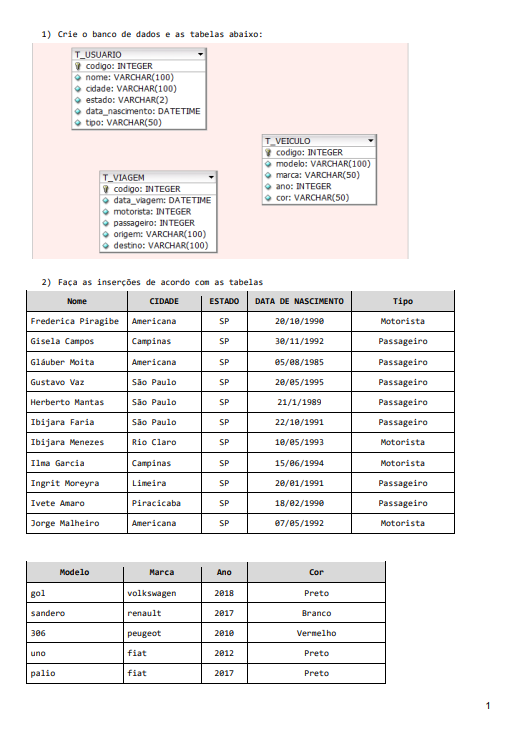
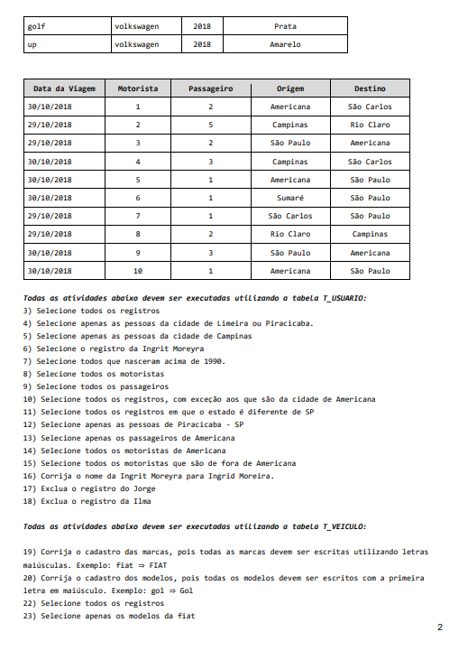
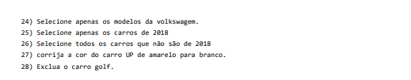

<h1 align='center'>📚 Atividades Caroneiro 📚</h1>

> Estas atividades, desenvolvidas na turma TI-24 do Senac Americana, são baseadas em soluções e resoluções discutidas sobre banco de dados MySQL durante as aulas de Downzin. Todos são convidados a se desafiar e resolver essas atividades por conta própria, proporcionando uma excelente oportunidade para treinar e aprimorar suas habilidades.

    
    
    

